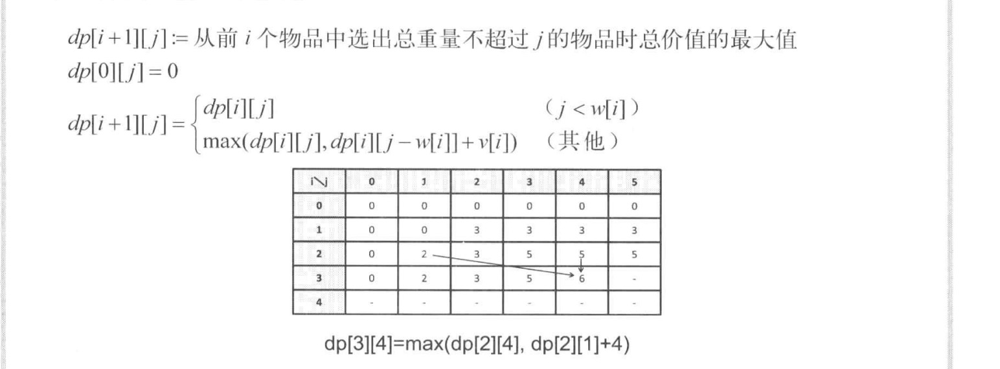
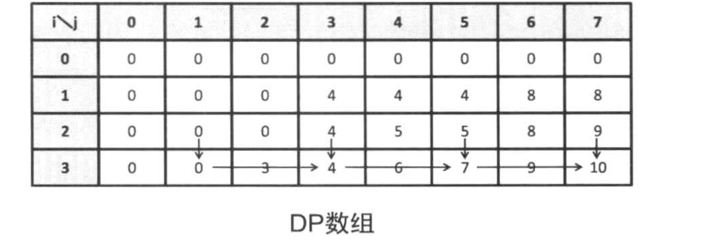

# 线形DP

> 线性DP：即线性动态规划，是一个比较广义的概念，不局限于“线性时间复杂度”的一维动态规划。与数学种的“线性空间”类似，如果一个动态规划算法的“状态”包含多个维度，但在每个维度上都具有“线性”变化的阶段，那么该动态规划算法同样称为"线性DP"。本文就几个经典、简单的线性DP问题作出总结。


## 一、背包问题

背包问题是线形DP中非常重要且典型的问题。


### 0/1背包

> **0/1背包模型** : 给定N个物品，其中第i个物品的体积为V~i~，价位为W~i~。有一容积为M的背包，要求选择一些物品放入背包，使得物品总体积不超过M的前提下，物品的价值和达到最大。

​	

 dp[ i, j ] 代表从前i个物品中选出总重量不超过j的物品时总价值的最大值。递推关系可以按照**是否取当前物品来划分**。

```c++
dp[i][j] = max(dp[i-1][j],dp[i-1][j-v[i] ] + w[i] );  //j>v[i]  max(不取当前物品i,取当前物品i)
dp[i][j] = dp[i-1][j];//j<v[i],只能不取当前物品
```


#### **0/1背包代码实现**

```c++
vector< vector<int> > dp(N+1,vector<int >(M+1,0));
for(int i=1;i<=N;i++)
        for (int j = 0; j <= M; j++)
        {
            if (j < v[i])dp[i][j] = dp[i - 1][j];
            else dp[i][j] = max(dp[i - 1][j], dp[i - 1][j - v[i]] + w[i]);
        }
```


**代码实现优化:** 

**1. 滚动数组** : 我们的dp数组是用了一个N*M空间大小的二维数组，实际上迭代的过程中，我们在计算dp[i]时只用到了dp[i]和dp[i-1], 所以只用两个二维数组就可表示状态转移:

```c++
vector< vector<int> > dp(2,vector<int >(M+1,0));
for(int i=1;i<=N;i++)
        for (int j = 0; j <= M; j++)
        {
            if (j < v[i])dp[i % 2][j] = dp[(i - 1) % 2][j];
            else dp[i % 2][j] = max(dp[(i - 1) % 2][j], dp[(i - 1) % 2][j - v[i]] + w[i]);
        }
```


**2. 重复一维数组**: 再来观察下二维dp数组，如果将二维数组打印出来的话，会发现:<u>当前点(i,j)依赖左上的点(i-1,j-v[i])和上面的点(i-1,j)</u>，我习惯称为: ↘ ↓依赖。这种依赖关系是可以将二维数组优化为倒叙一维数组去解决的（因为↘依赖，要保证i维度左边的数据是上一层循环的数据）。



```c++
vector<int> dp(M+1,0);//一维数组
for(int i=1;i<=N;i++)
        for (int j = M; j >= v[i]; j--)//倒序
        {
        		dp[j] = max(dp[j], dp[j - v[i]] + w[i]);
        }
```

**注意:重复利用一维数组可以节约内存空间，但使用不好也有可能留下bug，所以要格外小心。新手比较好的建议是先按照题意去写二维的，然后可以优化的话，在优化成一维的(滚动数组、重复一维数组)。另外，初学者可以把二维数组打印出来，看一下最优解的形成过程**

**LeetCode上个一些题是0/1背包的经典应用，在熟练理解0/1背包的原理后，这种很明显的0/1背包题就可以直接一维数组去写。**


#### **0/1背包练习题**

[POJ-3624 0/1背包模板题](https://vjudge.net/problem/POJ-3624)

```c++
#include<iostream>
#include<algorithm>

using namespace std;
int dp[13000];//0
int w[3500], v[3500];

int main() {
    int N, M;
    cin >> N >> M;
    for (int i = 1; i <= N; i++)
        cin >> w[i] >> v[i];
    for (int i = 1; i <= N; i++)
        for (int j = M; j >= w[i]; j--) {
            dp[j] = max(dp[j], dp[j - w[i]] + v[i]);
        }
    cout << dp[M];
}
```


[LeetCode 474. 一和零](https://leetcode-cn.com/problems/ones-and-zeroes/)

```c++
class Solution {
public:
    int dp[1111][1111];

    int findMaxForm(vector <string> &strs, int m, int n) {
        int size_str = strs.size();
        memset(dp, 0, sizeof(dp));

        for (int i = 0; i < size_str; i++) {
            int v_0 = 0, v_1 = 0;
            for (auto x:strs[i])x == '0' ? v_0++ : v_1++;
            for (int j = n; j >= v_1; j--)
                for (int k = m; k >= v_0; k--)
                    dp[j][k] = max(dp[j][k], dp[j - v_1][k - v_0] + 1);
        }
        return dp[n][m];
    }
};
```


[LeetCode 416. 分割等和子集](https://leetcode-cn.com/problems/partition-equal-subset-sum/)

```c++
class Solution {
public:
    bool canPartition(vector<int>& nums) {

        int sum = accumulate(nums.begin(),nums.end(),0);
        if(sum&1) return false;//奇数返回
        sum = (sum>>1);//取半
        vector<bool>dp(sum+11,false);
        dp[0] = 1;
        int n = nums.size();
        for(int i = 0;i<n;++i)
            for(int j = sum;j>=nums[i];--j)
                dp[j] = dp[j] || dp[ j - nums[i] ];

        return dp[sum];
    }
};
```


### 完全背包

> **完全背包模型** : 给定N个物品，其中第i个物品的体积为V~i~，价位为W~i~。有一容积为M的背包，要求选择一些物品放入背包，使得物品总体积不超过M的前提下，物品的价值和达到最大。**在这里，每种物品可以挑选任意多件。**

相比0/1背包，这次同一类物品可以取任意件数了。

```c++
dp[i][j] = max(dp[i - 1][j], dp[i][j - v[i]] + w[i]);//j>v[i].  max(尚未取过i物品,从第i种物品选一个)
dp[i][j] = dp[i - 1][j];//j<v[i]	
```


#### 完全背包代码实现

完全背包的代码实现和0/1背包类似，区别在于：完全背包是 → ↓ 依赖。类似的我们可以优化掉dp数组的i这一维，但是，j 这一维要正序遍历（**因为依赖关系→需要先得出当前i维度左边的数据，所以要正序**）。



```c++

vector<int> dp(M + 11, 0);

int solve() {
    for (int i = 0; i < N; i++) {
        for (int j = v[i]; j <= M; j++) {//正序
            dp[j] = max(dp[j], dp[j - v[i]] + w[i]);
        }
    }
    return dp[M];
}
```


#### 完全背包练习题

[518. 零钱兑换 II](https://leetcode-cn.com/problems/coin-change-2/)

```c++
//完全背包, 如果让输入所有路径呢?
class Solution {
public:
    int change(int amount, vector<int> &coins) {
        int n = coins.size();
        vector<int> dp(amount + 11, 0);
        dp[0] = 1;
        for (int i = 0; i < n; ++i) {
            for (int j = coins[i]; j <= amount; ++j)
                dp[j] += dp[j - coins[i]];
        }
        return dp[amount];
    }
};
```


[322. 零钱兑换](https://leetcode-cn.com/problems/coin-change/)

```c++
class Solution {
public:
    int f[111111];
    int coinChange(vector<int> &coins, int amount) {
        memset(f, 0x3f, sizeof f);
        f[0] = 0;
        int n = coins.size();
        for (int i = 1; i <= n; ++i)
            for (int j = coins[i - 1]; j <= amount; ++j) {
                f[j] = min(f[j], f[j - coins[i - 1]] + 1);
            }
        return f[amount] == 0x3f3f3f3f ? -1 : f[amount];
    }
};
```


## 二、最长上升子序列(LIS)

> 最长上升子序列(Longest Increasing Subsequence): 有一个长度为n的数列a0,a1,...an-1。请求出这个序列中最长的上升子序列的长度。上升子序列指的是对于任意的i<j都满足ai < aj 的子序列。
>
> 例子：
>
> 输入：nums = [10,9,2,5,3,7,101,18]
> 输出：4
> 解释：最长递增子序列是 [2,3,7,101]，因此长度为 4 。

### 实现原理

[LeetCode 300. 最长递增子序列](https://leetcode-cn.com/problems/longest-increasing-subsequence/)

```c++
/*
定义递推式 dp[i] : 以ai为结尾的最长上升子序列的长度
以ai为结尾的上升子序列是:
1.只包含ai的子序列
2.在满足j<i && aj<ai 的以aj为结尾的上升子列末尾，加上ai后得到的子序列

所以 dp[i] = max(1,dp[j] + 1) //j<i && aj < ai
*/

//实现代码 时间复杂度:O(n2)
int lengthOfLIS(vector<int> &nums) {
    int n = nums.size();
    vector<int> dp(n + 1, 0);
    int ans = -1;
    for (int i = 0; i < n; i++) {
        dp[i] = 1;
        for (int j = 0; j < i; j++)
            if (nums[j] < nums[i]) {
                dp[i] = max(dp[i], dp[j] + 1);
            }
        ans = max(ans, dp[i]);
    }
    return ans;
}

```


```c++

/*
更换一种递推关系式
定义递推式 dp[i] : 长度为i+1的上升子序列中末尾元素的最小值(不存在就INF)
dp数组初始化为INF。由前到后逐个考虑数列的元素，对于每个aj，如果i=0或者dp[i-1]<aj,就用dp[i] = min(dp[i],a[j])进行更新。最终找到除INF外的数组长度就是答案。

如果用DP去完成同样也是O(n2)的时间复杂度。
考虑到dp数组是单调递增的，每个元素ai最多需要一次更新，所以没必要逐个遍历，二分搜索即可，时间复杂度为O(n*logn)
*/

int lengthOfLIS(vector<int> &nums) {
    int n = nums.size();
    vector<int> dp(n + 1, INT_MAX);
    for (auto x:nums) {
        *lower_bound(dp.begin(), dp.end(), x) = x;//dp[j] = x;找到x在dp数组中的位置
    }
    return lower_bound(dp.begin(), dp.end(), INT_MAX) - dp.begin();//dp数组除INT_MAX外的长度即为答案.
}
```


## 三、最长公共子序列(LCS)


> 给定两个字符串 text1 和 text2，返回这两个字符串的最长 公共子序列 的长度。如果不存在 公共子序列 ，返回 0 。
>
> 一个字符串的 子序列 是指这样一个新的字符串：它是由原字符串在不改变字符的相对顺序的情况下删除某些字符（也可以不删除任何字符）后组成的新字符串。
>
> 例如，"ace" 是 "abcde" 的子序列，但 "aec" 不是 "abcde" 的子序列。
> 两个字符串的 公共子序列 是这两个字符串所共同拥有的子序列。
>
> 示例 ：
>
> 输入：text1 = "abcde", text2 = "ace" 
> 输出：3  
> 解释：最长公共子序列是 "ace" ，它的长度为 3 。

### 实现原理

[1143. 最长公共子序列](https://leetcode-cn.com/problems/longest-common-subsequence/)

```c++

/*
 * dp[i][j]: s1……si 和 t1……tj 对应的LCS的长度
 * s1……si+1 和 t1……tj+1 对应的公共子列可能是:
 * 1. 当s[i+1] == t[j+1]时，在s1……si 和 t1……tj 的最长公共子列末尾加上s[i+1]
 * 2. s1……si   和 t1……tj+1 的最长公共子列
 * 3. s1……si+1 和 t1……tj   的最长公共子列
 *
 * 所以当s[i] == t[j]时. dp[i+1][j+1] = dp[i][j]+1
 * 否则:                dp[i+1][j+1] = max(dp[i+1][j],dp[i][j+1])
 * 
 */


class Solution {
public:
    int longestCommonSubsequence(string word1, string word2) {
        int n = word1.size(), m = word2.size();
        vector <vector<int>> dp(n + 11, vector<int>(m + 11, 0));
        for (int i = 1; i <= n; i++)
            for (int j = 1; j <= m; j++)
                if (word1[i - 1] == word2[j - 1])
                    dp[i][j] = dp[i - 1][j - 1] + 1;
                else
                    dp[i][j] = max(dp[i - 1][j], dp[i][j - 1]);

        return dp[n][m];
    }
};
```


## 四、数字三角形

> 给定一个三角形 triangle ，找出自顶向下的最小路径和。
>
> 每一步只能移动到下一行中相邻的结点上。相邻的结点 在这里指的是 下标 与 上一层结点下标 相同或者等于 上一层结点下标 + 1 的两个结点。也就是说，如果正位于当前行的下标 i ，那么下一步可以移动到下一行的下标 i 或 i + 1 。
>
> 示例 1：
>
> 输入：triangle = [[2],[3,4],[6,5,7],[4,1,8,3]]
> 输出：11
> 解释：如下面简图所示：
>    2
>   3 4
>  6 5 7
> 4 1 8 3
> 自顶向下的最小路径和为 11（即，2 + 3 + 5 + 1 = 11）。

### 实现原理

F[i, j]表示从左上角出发，走到第i行，第j列，和最大是多少。

1. F[i, j] = min(F[i-1, j-1],F[i-1,j]) + A[i, j] (j!=1,j!=i)

2. F[i, j] = F[i-1, j-1]+ A[i, j]   (i==j)//每行最后一列

3. F[i, j] = F[i-1,j]  +  A[i ,j] (j==1)  //第一列

   

   **如前面背包问题的优化一样，这里的可以优化成重复一维数组，j那一维倒序即可。因为dp依赖左上和上，左上倒序需要倒序保证。**

   [LeetCode 120. 三角形最小路径和](https://leetcode-cn.com/problems/triangle/)

 ```cpp
/*
 * LeetCode-120 数字三角形
 * */
class Solution {
public:
    int minimumTotal(vector <vector<int>> &triangle) {
        //dp[i][j] = a[i][j] + min(dp[i-1][j-1],dp[i-1][j])
        int n = triangle.size();
        vector<int> dp(n + 2, 0);
        for (int i = 1; i <= n; i++) {
            for (int j = i; j >= 1; j--) {
                if (j == 1) dp[j] = dp[j] + triangle[i - 1][j - 1];
                else if (i == j)dp[j] = dp[j - 1] + triangle[i - 1][j - 1];
                else dp[j] = min(dp[j - 1], dp[j]) + triangle[i - 1][j - 1];
            }
        }
        return *min_element(dp.begin() + 1, dp.begin() + 1 + n);
    }

 ```


## 五、线性DP LeetCode练习题